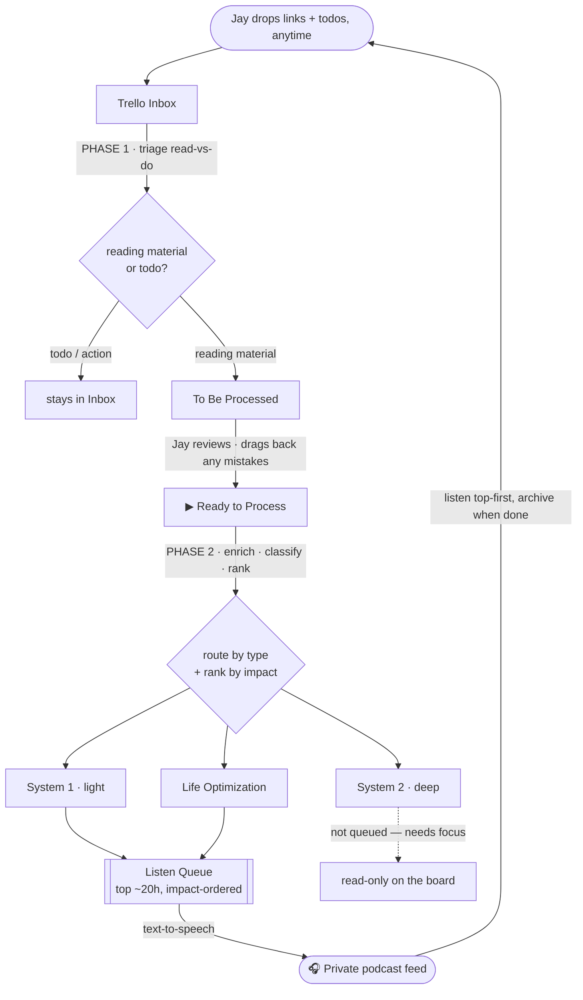
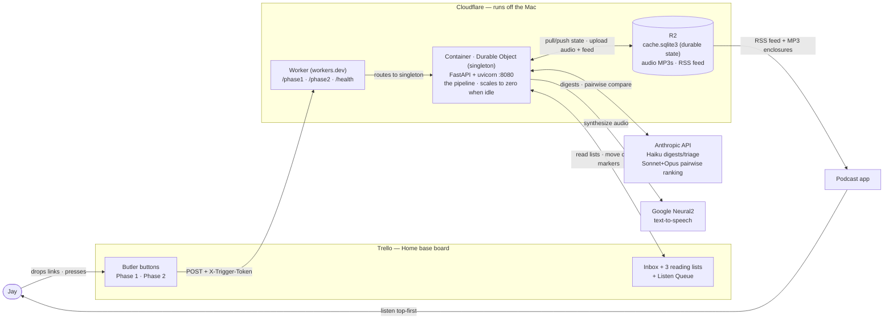

# Automated Counterfactual Podcast

Turns Jay's Trello reading lists into a priority-ordered, listen-first **private
podcast**. New links get sorted by *counterfactual impact* (what's most worth Jay's
time, given his goals), and the highest-impact readable material is converted to
speech and delivered as a podcast feed he can listen to top-first.

---

## The board

Three reading lists on the **Home base** Trello board:

- **System 1** — lighter material that doesn't need deep focus (newsletters, takes).
- **System 2** — deep, effortful reading (papers, long technical pieces).
- **Life Optimization** — productivity, health, career, meta.

Plus Trello's built-in **Inbox**, where Jay drops links throughout the week.

## What happens to a card

The Inbox is a mix of reading links **and** todos, so collection happens in **two
phases with a review checkpoint in between**:

- **Phase 1 (automatic)** — triage each Inbox card *read vs do*; move only the
  **reading material** into **To Be Processed**. Todos/notes stay in the Inbox.
- **You review** To Be Processed and drag any keepers into **▶ Ready to Process**
  (and drag mistakes back to the Inbox). This drag is the "go" button for Phase 2.
- **Phase 2 (triggered)** — drains ▶ Ready to Process: enrich, classify, rank into the
  three lists, top up the queue, publish. It runs as a poller, idle when the list is empty.

For each card the system:

1. **Reads the link.** Pulls the article text behind the card (the URL is stored as a
   Trello attachment). PDFs, articles, and plain text all work; paywalled/X/YouTube
   links are flagged as "can't read" and skipped for audio. **Comment sections are
   stripped** during extraction — without this, a blog post's comment thread gets read
   aloud too (one SSC post ballooned to 551k chars / ~9h of audio that was 91% comments).
   The full *article* is always kept, just not the comments below it.
2. **Summarizes it** into a short, impact-focused digest (via a cheap LLM pass), and
   estimates reading time from the word count.
3. **Decides which list** it belongs to — System 1, System 2, or Life Optimization.
4. **Ranks it by counterfactual impact** and slots it into that list at the right spot.

## How ranking works

Instead of giving each article a score, the system compares articles **two at a time**
— *"which of these should Jay read first?"* — using an LLM that's been given a profile
of Jay's goals, priorities, and what counts as high-impact for him. Thousands of these
head-to-head comparisons get sorted into a full ranking (like a tournament). Comparing
the short digests (not full articles) keeps it fast and cheap, and every decision is
cached so re-runs are nearly free.

## The listen queue & podcast

- The **Listen Queue** is kept topped up to ~20 hours of audio, pulled from the
  highest-impact **System 1 + Life Optimization** cards (System 2 stays read-only —
  deep material isn't meant for passive listening).
- Each queued card's text is converted to speech locally (free), and the queue is
  published as a **podcast RSS feed** hosted on Cloudflare. Jay subscribes in any
  podcast app, listens to the top item first, and **archives it when done** — the next
  run refills the queue from the best remaining cards.

## The two jobs

- **One-time sort** — rank the three existing reading lists by counterfactual impact
  and reorder them in place (with a per-card note explaining the rank). Safe by default:
  it shows a proposed order first and only reorders the board when told to apply.
- **Ongoing intake (two phases)** — **Phase 1** triages the Inbox and moves reading
  material to *To Be Processed* for your review; **Phase 2** (triggered when you drag
  cards into *▶ Ready to Process*) routes + ranks them, tops up the queue, and publishes.

Both run as scheduled jobs; every board-mutating step is dry-run by default and only
acts with `--apply`. See `reports/usage.md` for commands (`run_oneshot.sh`,
`run_phase1.sh`, `run_phase2.sh`).

## Architecture (deployed on Cloudflare, off the Mac)

A Trello button press (or `/health` check) hits a Cloudflare **Worker**, which routes to a
single **Container** (a Durable-Object-backed FastAPI app) that runs the whole pipeline and
calls out to Trello, Anthropic, and Google TTS — with all durable state (the SQLite cache,
audio, and the RSS feed) living in **R2**. The container scales to zero when idle, so nothing
runs on, or depends on, the Mac.

## Where things live

- `src/counterfactual_podcast/` — the code (one focused module per stage).
- `reports/` — the implementation plan, budget analysis, and the usage runbook.
- `CLAUDE.md` — durable project context and learnings.
- `private/` & `.env` — Jay's profile doc, board backups, and secrets (never committed).

See `reports/usage.md` for exact commands.
